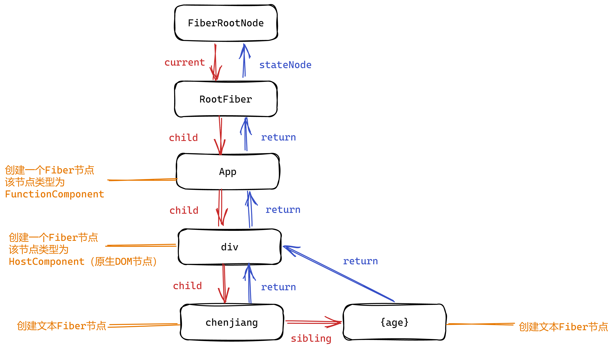
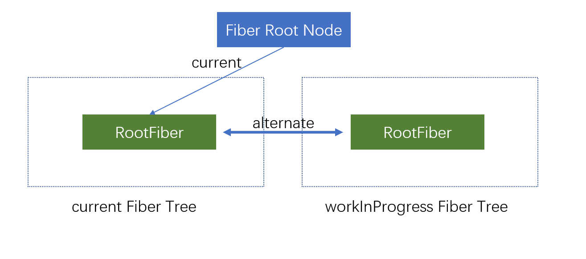

# 浅谈React Fiber工作原理

## 静态数据结构

每个Fiber节点对应一个组件，保存了该组件的类型，对应的DOM节点的对应信息。

FiberRootNode有且仅有一个，而rootFiber可以有多个，因为我们可以挂载多个应用（也就是多次调用`ReactDOM.render`）

```js
function App(props) {
  const [age, setAge] = useState(24);
  return (
    <div>
      chenjiang
      {age}
    </div>
  );
}

ReactDOM.render(<App />, document.getElementById("root"));
```

最终形成数据结构如下：




### Fiber的数据结构

```js

function FiberNode(
  tag: WorkTag,
  pendingProps: mixed,
  key: null | string,
  mode: TypeOfMode,
) {
  // Instance

   // 组件的类型 FunctionComponent、classComponent、HostComponent（指的是DOM节点对应的Fiber节点）
  this.tag = tag;
  
  this.key = key; 

  // 大多数情况下于tag相同，使用React.memo包裹时候，elementType和tag不同
  this.elementType = null;

  // 对于FunctionComponent，指函数本身
  // 对于ClassComponent，指class
  // 对于HostComponet，指的是DOM节点tagName
  this.type = null;

  // 对于HostComponent来说指的是对应的真实的DOM节点
  this.stateNode = null; 

  // 以下属性用于连接其他Fiber节点形成Fiber树。

  // 指向父fiber节点
  this.return = null;
  
  // 指向第一个子fiber节点
  this.child = null;

  // 指向第一个兄弟fiber节点
  this.sibling = null;
  this.index = 0;

  // ref属性
  this.ref = null;

  // 新传入的 props
  this.pendingProps = pendingProps;

  // 之前的 props
  this.memoizedProps = null;

  // 更新队列，用于暂存 setState 的值
  this.updateQueue = null;

  // 之前的 state
  this.memoizedState = null;
  this.dependencies = null;

  this.mode = mode;

  // 保存本次更新会造成的DOM操作。比如删除，移动
  this.flags = NoFlags;
  this.nextEffect = null;

  this.firstEffect = null;
  this.lastEffect = null;

  this.lanes = NoLanes;
  this.childLanes = NoLanes;


  //用于链接新树和旧树；旧->新，新->旧
  this.alternate = null;
}
```

## 动态的工作单元

Fiber可以理解成一个工作单元，每次执行完一个工作单元，react就会检查还剩余多少时间，如果没有就把控制权交还给浏览器。React Fiber月浏览器的核心交互过程如下：

  

首先 React 向浏览器请求调度，浏览器在一帧中如果还有空闲时间，会去判断是否存在待执行任务，不存在就直接将控制权交给浏览器，如果存在就会执行对应的任务，执行完成后会判断是否还有时间，有时间且有待执行任务则会继续执行下一个任务，否则就会将控制权交给浏览器。

Fiber 可以被理解为划分一个个更小的工作单元，它是把一个大任务拆分为了很多个小块任务，一个小块任务的执行必须是一次完成的，不能出现暂停，但是一个小块任务执行完后可以移交控制权给浏览器去响应用户，从而不用等待大任务一直执行完成再去响应用户。

## 双缓存工作机制

### 什么是双缓存

当我们用`canvas`绘制动画，每一帧绘制前都会调用`ctx.clearRect`清除上一帧的画面。如果当前帧画面计算量比较大，导致清除上一帧画面到绘制当前帧画面之间有较长间隙，就会出现白屏闪烁。

为了解决这个问题，我们可以在`内存中`绘制当前帧动画，绘制完毕后直接用当前帧替换上一帧画面，由于省去了两帧替换间的计算时间，不会出现从白屏到出现画面的闪烁情况。

这种**在内存中构建并直接替换**的技术叫做[双缓存](https://link.juejin.cn?target=https%3A%2F%2Fbaike.baidu.com%2Fitem%2F%E5%8F%8C%E7%BC%93%E5%86%B2)。

`React`使用“双缓存”来完成`Fiber树`的构建与替换——对应着`DOM树`的创建与更新。

### 双缓存Fiber树

React中存在两棵树，一颗为`current Fiber tree`，另外一颗为`workInProgress Fiber tree`。

- `current Fiber tree`也就是当前页面中显示内容对应的Fiber树，每个Fiber节点成为current fiber。
- `workInProgress Fiber tree`正在内存中构建的Fiber树。

两颗树的fiber节点是通过`alternate`属性进行连接的。

```js
currentFiber.alternate === workInProgressFiber;
workInProgressFiber.alternate === currentFiber;
```

React的根节点（FiberRootNode）通过current指针在不同的Fiber树的rootFiber间切换来实现Fiber树的切换。



